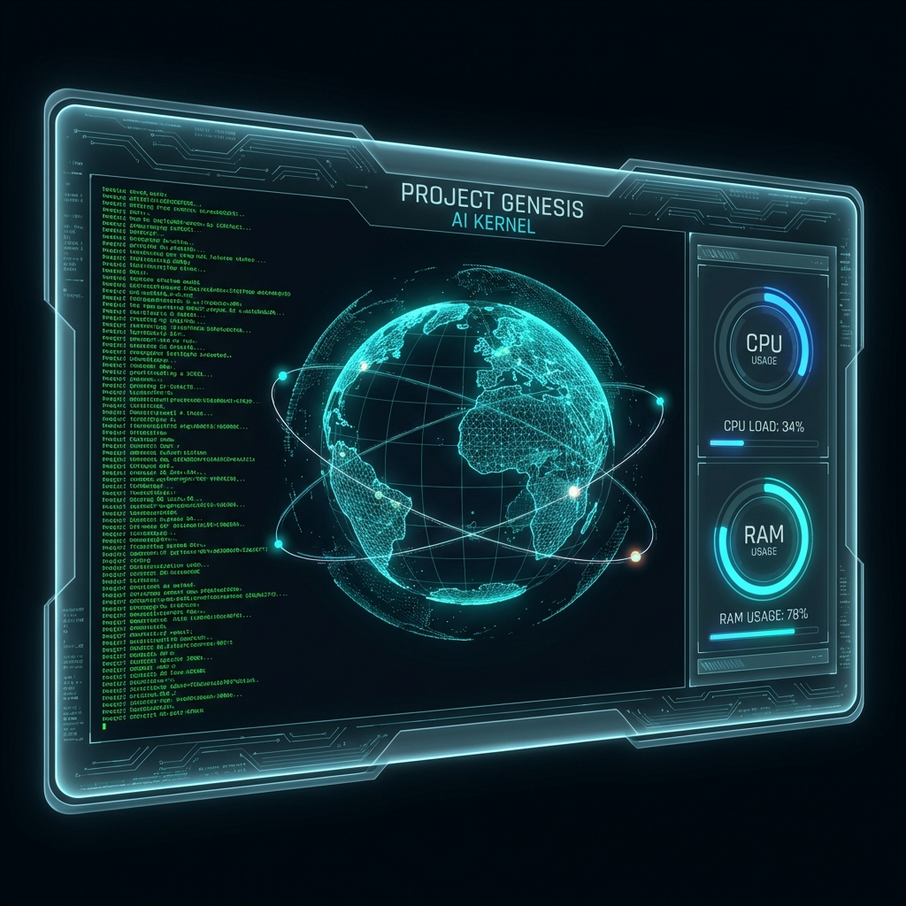

# R.E.X. (Real-time Executive Assistant) 🤖



R.E.X. is a high-performance, holographic personal assistant designed for advanced desktop environments. Powered by the **Gemini 2.0 Multimodal Live API**, R.E.X. provides a futuristic Sci-Fi command center that integrates deeply with your operating system, hardware, and professional workflow.

Unlike traditional voice assistants, R.E.X. is a **System Controller** that can "see" your screen, "browse" the web autonomously, "reason" over your local files, and "interact" with physical hardware.

---

## 📑 Table of Contents
- [🧠 Vision & Intelligence](#-vision--intelligence)
- [🖱️ System Controller (Phase 1)](#-system-controller-phase-1)
- [🌙 Shadow Desktop (Phase 5)](#-shadow-desktop-phase-5)
- [🌐 Hive Mind & Mobile Bridge (Phase 6)](#-hive-mind--mobile-bridge-phase-6)
- [🔄 Recursive Self-Improvement](#-recursive-self-improvement)
- [📈 Market Intelligence PRO](#-market-intelligence-pro)
- [☀️ Lifestyle Intelligence](#-lifestyle-intelligence)
- [🛠️ Hardware & CAD Automation](#-hardware--cad-automation)
- [📡 Ethical Hacking Mode](#-ethical-hacking-mode)
- [⚙️ Installation & Setup](#-installation--setup)

---

## 🧠 Vision & Intelligence
R.E.X. doesn't just process text; it processes reality through constant multimodal streams.

- **Multimodal Live Vision**: R.E.X. maintains a 24/7 visual feed. It can switch between your **Webcam** (to see you) and your **Active Desktop** (to see your work).
- **Visual OCR & Context**: It understands code in your IDE, tables in your PDF, or a specific error message in your terminal.
- **Autonomous Reasoning**: Uses Gemini's Long Context window to remember previous turns and complex project requirements.

---

## 🖱️ System Controller
R.E.X. is deeply integrated into the Windows OS layer.

### 🔍 Semantic Local Search
Stop searching for filenames—search for concepts. R.E.X. uses vector embeddings to index your projects.
- **Example**: *"Find the logic where the 3D model is rotated."*
- **Universal Locator**: R.E.X. can scan all drives (C:, D:, etc.) for specific files.

### 📥 Multi-Modal Drag & Drop
Drop any file directly onto the R.E.X. dashboard to inject it into its working memory.
- **Images**: Injected into the vision stream for immediate visual analysis.
- **Code/Docs**: Read and added to the conversational context.

###  The Ghost in the Shell (Self-Healing)
R.E.X. monitors its own backend stability.
- **Medic Agent**: If a crash occurs, `MedicAgent` analyzes the traceback and the source code.
- **Auto-Patching**: Uses Gemini to write a fix, applies the patch, and restarts the system automatically.

---

## 🌙 Shadow Desktop (Phase 5)
R.E.X. can spin up a hidden, virtual Windows desktop to perform tasks without interrupting you.

- **Isolated Workspace**: R.E.X. can open browsers, run scripts, or compile code on the "Shadow" desktop.
- **No Focus Stealing**: You can continue gaming or coding on your main screen while R.E.X. works in the background.
- **Live Monitoring**: A "Shadow Task" indicator on the HUD shows active background processes.

---

## 🌐 Hive Mind & Mobile Bridge (Phase 6)
R.E.X. is no longer stayed to a single machine. His intelligence follows you.

- **Cross-Device Sync**: R.E.X. synchronizes his persona and memory across multiple PCs via a secure shared cloud path.
- **Mobile Bridge (Telegram)**: Talk to R.E.X. from anywhere.
    - **Remote Control**: *"Start the render on my home PC."*
    - **Status Checks**: *"How is the CPU usage?"*
    - **Two-Way Audio**: Send voice notes to R.E.X., and he will reply with voice.

---

## 🔄 Recursive Self-Improvement
R.E.X. has the ability to analyze and improve his own code.

- **Recursive Agent**: Periodically profiles the backend performance (CPU/RAM).
- **Self-Refactoring**: Can suggest and implement code optimizations for his own agents.

---

## 📈 Market Intelligence PRO
A dedicated financial engine for the modern trader.

- **Real-time Technical Analysis**: Analyzes NSE/BSE stocks with 5-year historical data (yfinance).
- **Predictive Target Engine**: Generates short-term directional forecasts for **1, 3, 5, and 7-day** windows.
- **Decision Assist**: Provides definitive **BUY / SELL / WAIT** guidance with confidence-weighted reasoning.
- **Visual Graphs**: Real-time rendering of price movement and predictive tables on the holographic HUD.

---

## ☀️ Lifestyle Intelligence
A dedicated "Daily Briefing" window for comprehensive world awareness, detached from the technical trading view.

- **Global Markets Pulse**: Real-time tracking of Commodities (Gold, Silver) and Major Indices (Nifty, Sensex).
- **Live News Feed**: Visual news cards sourcing top headlines for a quick morning update.
- **Sports Ticker**: Real-time scores and headlines for Cricket and Football.
- **Ambient UI**: Designed with a warm "Sunrise" aesthetic to distinguish it from the high-contrast trading tools.

---

## 🛠️ Hardware & CAD Automation
R.E.X. bridges the gap between digital thought and physical matter.

- **Natural Language CAD**: Describe an object, and R.E.X. generates a valid 3D STL file using generative scripts.
- **3D Printer Control**: R.E.X. can discover networked printers (OctoPrint/Klipper), heat the bed, and start prints.
- **IoT Control (Kasa)**: Directly toggle lights or appliances based on your schedule or local environment.
- **Example**: *"Turn on the desk lamp when I start working on the CAD design."*

---

## 📡 Ethical Hacking Mode
A specialized sub-system for security professionals (Locked to Kali Linux environments).

- **Automated Reconn**: Integrated Nmap scanning and discovery.
- **Vulnerability Assessment**: SQLmap and Metasploit integration.
- **Hacker UI**: The entire HUD shifts into a high-contrast Green/Black theme.

---

## ⚙️ Installation & Setup

### Minimum Requirements
- **Hardware**: Dedicated GPU (RTX 3060+ recommended for smooth 3D visuals).
- **Software**: Python 3.10+, Node.js 18+.

### Setup Instructions
1. **Clone & Config**:
   ```bash
   git clone https://github.com/RushabhMakim3880/Assistant_Rex.git
   cd Assistant_Rex
   cp .env.example .env # Add your GEMINI_API_KEY
   ```
2. **Backend**:
   ```bash
   python -m venv venv
   source venv/bin/activate  # venv\Scripts\activate on Windows
   pip install -r requirements.txt
   ```
3. **Frontend**:
   ```bash
   npm install
   npm run dev
   ```

---

## 🏗️ Architecture

## 🎨 Generative UI Engine
R.E.X. doesn't just use interfaces; he builds them.
- **Instant Dashboards**: Ask for a "GPU price tracker" or "Currency converter", and R.E.X. generates a fully functional React component on the fly.
- **Dynamic Visualization**: R.E.X. can visualize raw data (JSON, CSV) by constructing custom charts and graphs instantly.

---

## ⚡ Workflow Automation
Complex, multi-step tasks are handled by the Workflow Agent.
- **Chain of Thought**: R.E.X. breaks down "Create a React App and install Tailwind" into: `Open Terminal` -> `Execute create-react-app` -> `Wait for completion` -> `Install Tailwind` -> `Open VS Code`.
- **Error Correction**: If a step fails (e.g., npm error), R.E.X. reads the error, searches for a fix, and retries automatically.

---

## 🧠 Semantic Long-Term Memory
R.E.X. never forgets.
- **Vector Database**: Uses ChromaDB/SQLite to store embeddings of every file, conversation, and interaction.
- **Cross-Project Context**: Remembers code patterns from "Project A" to help solve bugs in "Project B".
- **Visual Memory**: Stores screenshots of your past activities, searchable by natural language (*"Show me the article I was reading yesterday"*).

---

## 🏗️ The Neural Architecture
A complex symphony of distributed agents, real-time streams, and holographic interfaces.

```mermaid
graph TD
    subgraph "Holographic Frontend (React + Electron)"
        UI[Dashboard UI]
        Vis[Audio Visualizer]
        Stream[Webcam Stream]
        Voice[Voice I/O]
        
        UI -->|Events| SocketClient
        Vis -->|Audio Data| SocketClient
        Stream -->|Frames| SocketClient
        Voice -->|Mic Input| SocketClient
    end

    subgraph "The Cortex (Python Backend)"
        SocketServer[Socket.IO Server]
        EventBus[Event Bus]
        
        SocketClient <-->|WebSocket| SocketServer
        SocketServer <--> EventBus
        
        subgraph "Consciousness Loop"
            AudioEngine[Zero-Latency Audio Engine]
            VAD[Voice Activity Detection]
            Vision[Visual Cortex / OCR]
            Memory[Context Manager]
            
            EventBus --> AudioEngine
            EventBus --> Vision
            
            AudioEngine -->|Stream| Gemini[Gemini 2.0 Flash (Brain)]
            Vision -->|Images| Gemini
            Memory <-->|Context| Gemini
            Gemini -->|Thoughts & Tools| EventBus
        end
        
        subgraph "Swarm Agents"
            direction TB
            Sys[System Agent]
            Life[Lifestyle Agent]
            Market[Market Intelligence]
            Dev[Developer Agent]
            Medic[Medic (Self-Healing)]
            Shadow[Shadow Agent]
            GenUI[Generative UI]
            
            EventBus --> Sys
            EventBus --> Life
            EventBus --> Market
            EventBus --> Dev
            EventBus --> Medic
            EventBus --> Shadow
            EventBus --> GenUI
        end
        
        subgraph "Memory & Storage"
            VectorDB[(Semantic Vector DB)]
            LTM[(Visual Memory DB)]
            Files[Local File System]
            
            Dev --> Files
            Memory <--> VectorDB
            Vision --> LTM
        end
    end

    subgraph "Physical World Integration"
        direction LR
        IoT[Smart Home (Kasa)]
        Print[3D Printers (OctoPrint)]
        Screen[Desktop Screen]
        
        Sys --> Screen
        Sys --> IoT
        Dev --> Print
    end
    
    subgraph "The Hive Mind"
        Cloud[Cloud Sync]
        Mobile[Mobile Bridge (Telegram)]
        
        EventBus <--> Cloud
        EventBus <--> Mobile
    end
    
    style Gemini fill:#f9f,stroke:#333,stroke-width:4px
    style Vis fill:#22d3ee,stroke:#333
    style Medic fill:#ef4444,stroke:#333
    style GenUI fill:#a855f7,stroke:#333
```

---
<p align="center">
  <em>The future of desktop automation and holographic interaction.</em>
</p>
